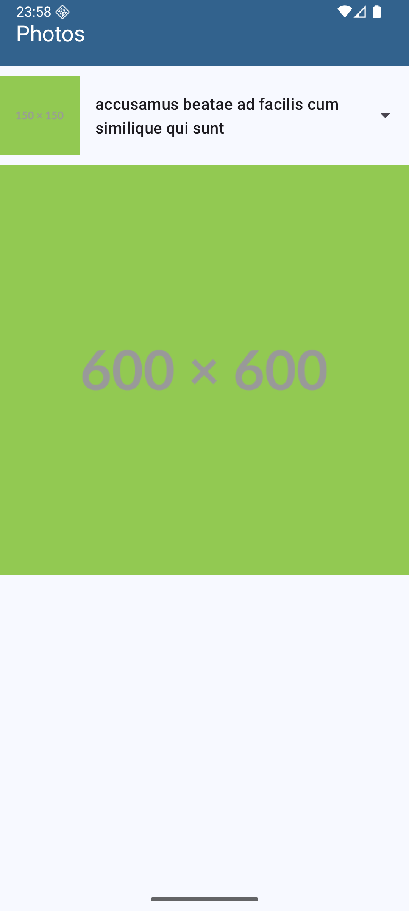
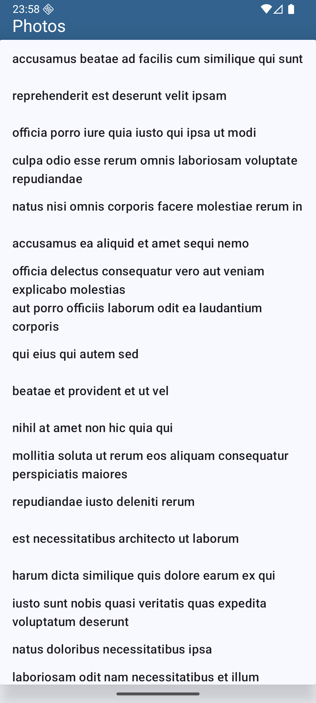
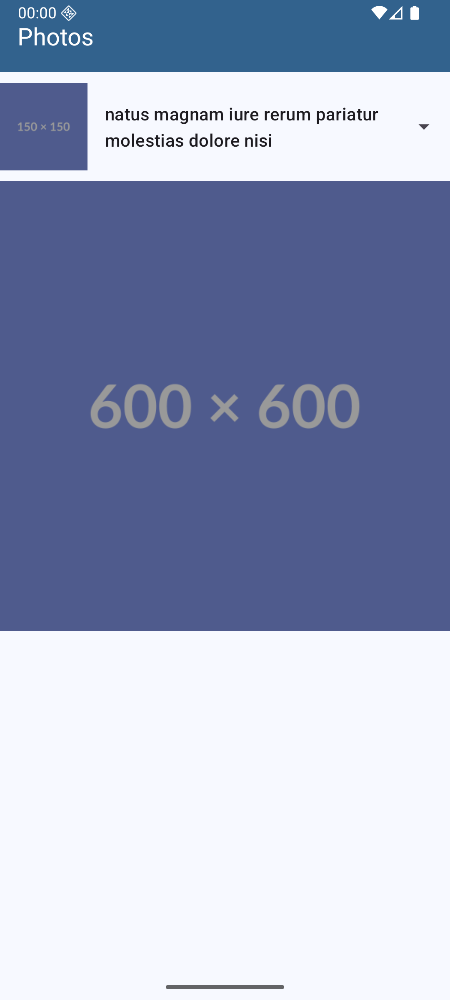

# Photos

## Sobre

Photos Manager é um aplicativo Android desenvolvido em Kotlin como parte da disciplina Desenvolvimento Android 2 do curso de Especialização em Desenvolvimento de Sistemas para Dispositivos Móveis do IFSP - Câmpus São Carlos. O projeto usa a biblioteca Volley e Gson e explora os conceitos relacionados ao consumo e manipulação de recursos disponibilizados por um Web Service a partir de requisições HTTP e respostas em JSON.

O aplicativo utiliza o Web Service JSONPlaceholder ([https://jsonplaceholder.typicode.com/](https://jsonplaceholder.typicode.com/)) e o seu recurso `/photos`. O aplicativo busca as fotos cadastradas no Web Service e exibe o título (atributo `title`) de cada uma delas em um `Spinner` para que o usuário possa selecionar. Ao selecionar um título, são exibidas a foto principal (disponível no atributo `url`) e o thumbnail (disponível no atributo `thumbnailUrl`) do objeto selecionado. Para exibir as imagens, são utilizados dois objetos `ImageView`.

## Screenshots

  

  

  

